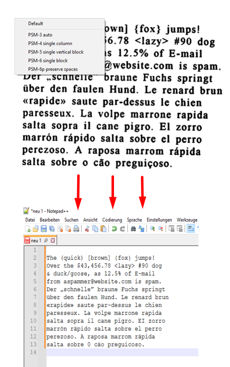

# Tesseract OCR Screenshot Tool (AutoHotkey v2)

This script allows you to capture a selected screen area, run OCR (Optical Character Recognition) using Tesseract, and retrieve the recognized text. It includes a tray menu with options for language and layout configurations.

## Features

- Screenshot area selection using Snipping Tool
- Text recognition via Tesseract OCR
- Language and PSM (Page Segmentation Mode) menu
- AutoHotkey v2-compatible
- Temporary file cleanup and logging

## Prerequisites

### ✅ Required software

Make sure the following tools are installed and added to your system's `PATH`:

1. **[AutoHotkey v2](https://www.autohotkey.com/download/)**  
   Used to run the script.

2. **[Tesseract OCR](https://github.com/tesseract-ocr/tesseract)**  
   OCR engine. You can install it via [Tesseract installer for Windows](https://github.com/UB-Mannheim/tesseract/wiki).

3. **[ImageMagick](https://imagemagick.org/script/download.php#windows)**  
   Required for converting clipboard images to files.

### ⚙️ Optional

- Additional language packs for Tesseract (e.g. `rus`, `ukr`, `deu`)
- Add `magick` and `tesseract` commands to your environment `PATH`

## Installation

1. Clone or download this repository.
2. Edit the script if needed to adjust languages or PSM modes.
3. Double-click `tesseract.ahk` (or run with AutoHotkey v2).
The programm runs minimized in system tray
You can use Right-click on the tray icon to access the menu and exit the programm

## Usage (see [demo](https://youtu.be/kWn-IFbZm1k) on YouTube)
- Press `CapsLock` + `PrnScr`
- The script will prompt you to select an area via Snipping Tool.
- It makes a screenshot and saves it in temp folder
- Select the language in popup menu
- OCR will be performed and results saved in system clipboard
- Press `Ctrl` + `V` to paste the text into Editor

## Notes

- This script stores intermediate files in your system's temp folder.
- Make sure `snippingtool.exe`, `magick`, and `tesseract` are all callable from the command line.

## License

MIT License. Feel free to modify and share.
### ⚙️ Optional

- Additional language packs for Tesseract (e.g. `rus`, `ukr`, `deu`)
- Add `magick` and `tesseract` commands to your environment `PATH`

## Installation

1. Clone or download this repository.
2. Edit the script if needed to adjust languages or PSM modes.
3. Double-click `tesseract.ahk` (or run with AutoHotkey v2).
The programm runs minimized in system tray
You can use Right-click on the tray icon to access the menu and exit the programm

## Usage (see [demo](https://youtu.be/kWn-IFbZm1k) on YouTube)
- Press `CapsLock` + `PrnScr`
- The script will prompt you to select an area via Snipping Tool.
- It makes a screenshot and saves it in temp folder
- Select a type of block and a language in popup menu
- OCR will be performed and results saved in system clipboard
- Press `Ctrl` + `V` to paste the text into Editor

## Notes

- This script stores intermediate files in your system's temp folder.
- Make sure `snippingtool.exe`, `magick`, and `tesseract` are all callable from the command line.

## License

MIT License. Feel free to modify and share.

## Screenshot

